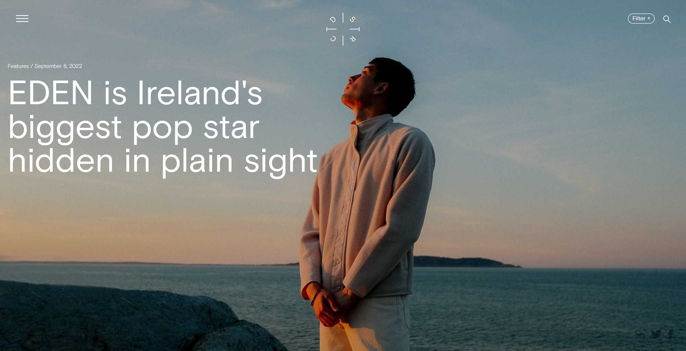
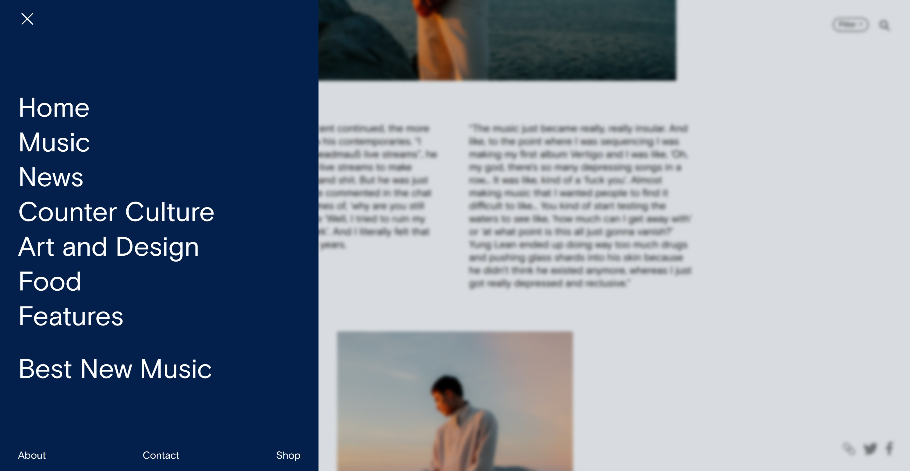
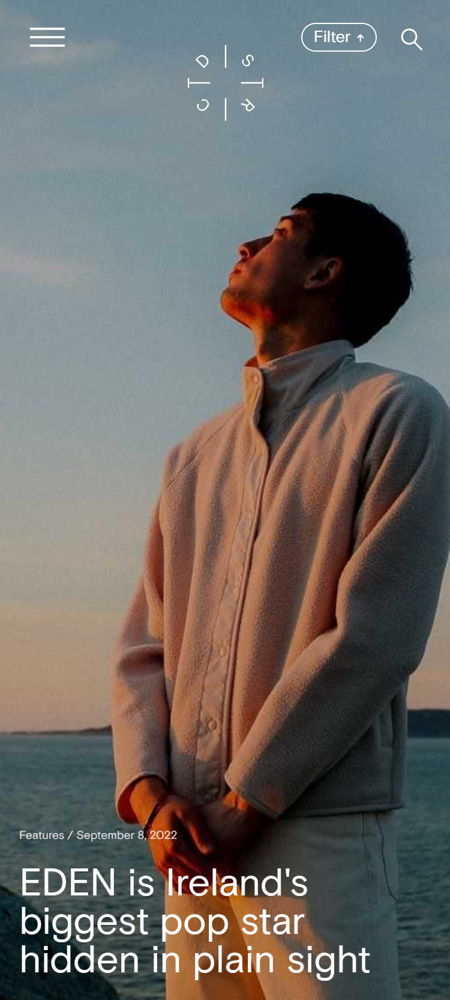
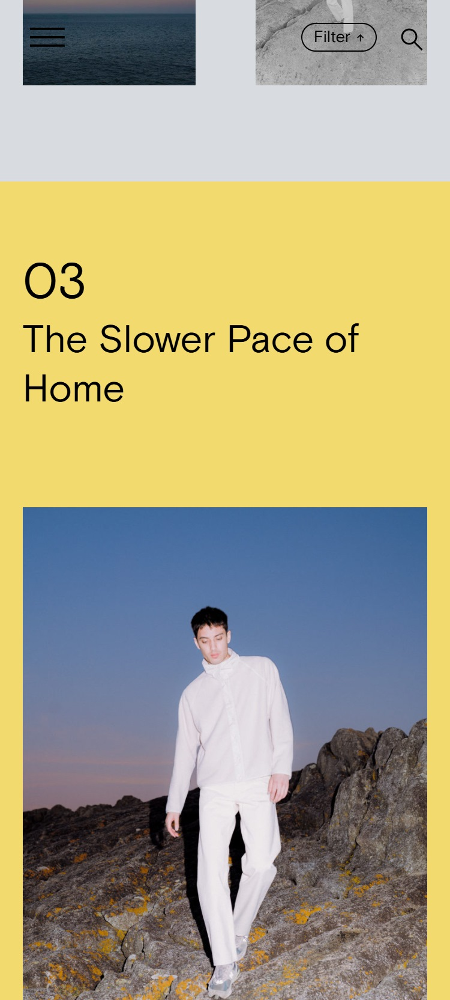

# District Magazine - EDEN Article Clone
This is a front-end clone of the article page ["EDEN is Ireland's biggest pop star hidden in plain sight"](https://districtmagazine.ie/music/eden-is-irelands-biggest-pop-star-hidden-in-plain-sight/), built using **HTML**, **CSS**, and **JavaScript**.

## Live Demo
[View Live Project on Netlify](https://district-magazine-eden.netlify.app/)

## About
The purpose of this project is to practice responsive layout techniques, modern web design by recreating a real-world magazine article page.

The clone includes:
- Hero image with text overlay
- Responsive typography
- Styled navigation and article structure
- Custom CSS for layout and transitions
- Scroll and hover effects

## 📸 Screenshots

### Desktop View

###  Mobile View

## ⚒ Technologies Used

- HTML5
- CSS3
- Vanilla JavaScript

## Disclaimer
This project is for educational purposes only. All content (images, text) belongs to [District Magazine](https://districtmagazine.ie/).
